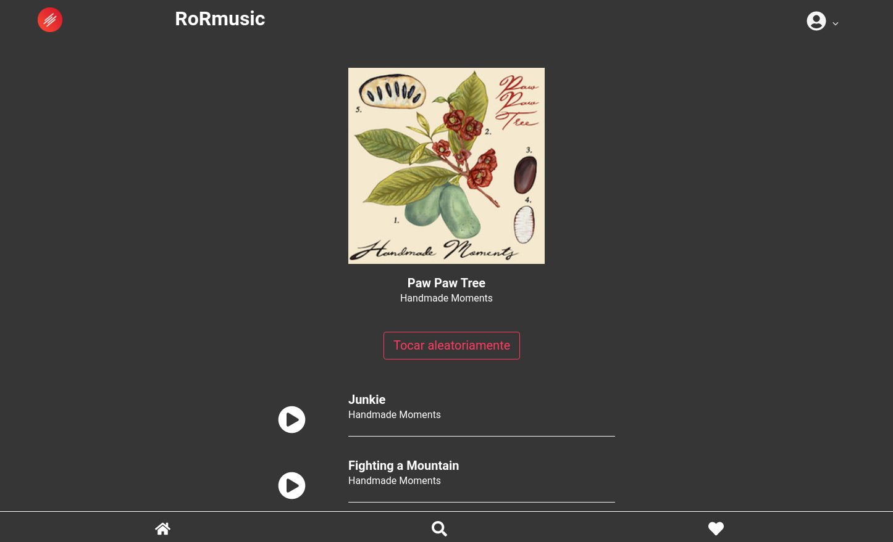

# ReactJs version of RoRmusic app
--------
## An music app using rails

This README would normally document whatever steps are necessary to get the
application up and running.

  

  

  <!--  -->

  

## 📋 Features

- [ ] Listen your songs
- [ ] favorite songs, artists, albums
- [ ] filter by categories, albums, artists
- [ ] Search functionality

<!-- Things you may want to cover:

* Ruby version

* System dependencies

* Configuration

* Database creation

* Database initialization

* How to run the test suite

* Services (job queues, cache servers, search engines, etc.)

* Deployment instructions

* ... -->
